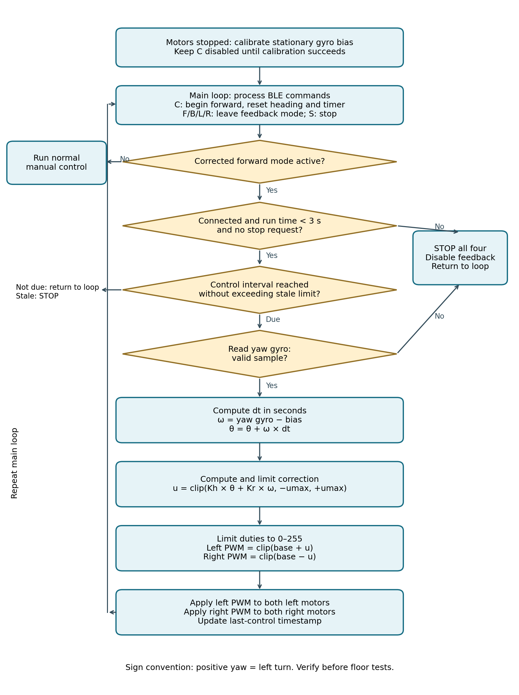

# Lab 4 — Finalize Encoders + Straight-Line Test

DateWednesday 14 October

Depends onLab 3 baseline runs

MilestoneEncoder distance scale + baseline vs. IMU-corrected straight runs

StatusIMU part written; encoder part outline

## Objectives

Validate encoder counts, direction, pulses per revolution and distance
conversion. Complete three baseline and three IMU-corrected straight runs, and
compare the encoders and the IMU as feedback sources.

**Required evidence:** working encoder readings with a documented distance
scale, and a straight-line comparison with the gain values used.

## Part A — Encoders

Validate on every wheel:

- counts and direction,
- pulses per revolution,
- the conversion from counts to distance.

See [Lab 2](lab02-motor-characterization.md) for the encoder test procedure and
equations.

## Part B — IMU straight-line controller

Improve the car's three-second forward run using IMU feedback. Implement the
controller in a copy of the [Lab 3](lab03-motors-imu.md) starter sketch and
compare it with the existing `F` command. The front and rear motors on each side
receive the same duty command.

### What you must implement

1. **Calibrate the yaw gyro** while the car is stationary for 2–3 s with all motors stopped. Average the samples to estimate the bias. Reject the calibration if reads fail or the car moves; keep corrected driving disabled until calibration succeeds.
2. **Add a `C` command** and phone button for corrected forward motion. Keep `F` as the baseline. On `C`, reset the relative heading to zero, set both sides forward, and start a fresh three-second timer.
3. **Update the controller locally every 10–20 ms.** Use the actual elapsed time in seconds. Keep the once-per-second BLE telemetry separate from the control loop.
4. **Use the equations below** to remove the gyro bias, integrate heading, compute a limited correction and adjust both sides. Verify the yaw axis and sign before enabling correction.
5. **Apply feedback only during `C` motion.** `S`, a disconnect, the three-second timeout, a failed sensor read or a stale controller must stop all four motors and disable feedback. Choose and document a stale limit, for example 100 ms. `F`/`B`/`L`/`R` must exit feedback mode.
6. **Keep front-left and rear-left duties equal**, and front-right and rear-right equal. Once directions are set, update the PWM directly; do not call `applyMotion()` every cycle, because it adds a 20 ms off interval.

### Test before driving

Raise the wheels and gently turn the chassis left during corrected motion. The
duty change must **oppose** the measured turn; if it reinforces it, reverse the
correction sign. Start floor tests at low speed with a limited correction, for
example ±30 PWM counts. Tune the gains experimentally; they are not universal
values.

### Control equations

Use radians, rad/s and seconds throughout. clip(x, a, b) = min(max(x, a), b).
Subscript *k* is the current sample, *k*−1 the previous one.

**1. Stationary gyro bias**

$$ b = \frac{1}{N} \sum_{i=1}^{N} g_i $$

$g_i$: stationary yaw-gyro samples (rad/s); $N$: number of valid samples; $b$: bias (rad/s).

**2. Bias-corrected angular velocity**

$$ \omega_k = g_k - b $$

**3. Elapsed time and relative heading**

$$ \Delta t_k = \frac{t_k - t_{k-1}}{10^6} \qquad \theta_k = \theta_{k-1} + \omega_k \Delta t_k, \quad \theta_0 = 0 $$

Timestamps from `micros()`; for `millis()` divide by 1000 instead. Reset θ and
the previous-control timestamp at the start of each `C` run.

**4. Heading and yaw-rate correction**

$$ u_k = \operatorname{clip}(K_h \theta_k + K_r \omega_k,\ -u_{max},\ +u_{max}) $$

$K_h$: heading gain (PWM counts/rad); $K_r$: yaw-rate gain (PWM counts per
rad/s); $u_{max}$: maximum correction in PWM counts. Start small and increase
gradually.

**5. Left and right duties**

$$ P^L_k = \operatorname{clip}(P_0 + u_k, 0, 255) \qquad P^R_k = \operatorname{clip}(P_0 - u_k, 0, 255) $$

$P_0$: common base duty. Round the limited values to integer PWM counts. These
signs assume positive yaw is a left turn: more left duty and less right duty
gives a right-turn correction.

**6. Apply to all four motors**

$$ P_{FL} = P_{RL} = P^L_k \qquad P_{FR} = P_{RR} = P^R_k $$

The starter's `M1` is the left side and `M2` the right side. This is skid
steering with no steering servo.

This controller tries to hold the starting heading. A gyro has bias and drift
and does not measure sideways position, and zero yaw rate alone cannot restore a
heading that has already changed. Discuss these limits in your report.

### Algorithm

Follow this flowchart in your own code. Stop checks must stay responsive
between controller updates; return to the main loop immediately when an update
is not yet due.

## Testing and submission

Run three baseline `F` runs and three corrected `C` runs with the same start
mark, surface, base PWM, battery condition and three-second duration. Measure
forward distance and absolute sideways displacement.

| Mode | Trial | Forward distance (cm) | Sideways displacement (cm) |
| --- | --- | --- | --- |
| F: baseline | 1 | `____` | `____` |
| F: baseline | 2 | `____` | `____` |
| F: baseline | 3 | `____` | `____` |
| C: feedback | 1 | `____` | `____` |
| C: feedback | 2 | `____` | `____` |
| C: feedback | 3 | `____` | `____` |

Average the absolute sideways displacement. Report both forward distance and
sideways error: a slower or shorter run can look like less drift. If the
baseline mean error is nonzero,

$$ \text{improvement (\%)} = 100 \times \frac{\text{baseline mean |error|} - \text{feedback mean |error|}}{\text{baseline mean |error|}} $$

Keep negative values when feedback makes it worse.

**Submit:** your modified `.ino`, a screenshot of the `C` button, a short video
of baseline and corrected runs, the completed table, and a brief explanation of
the outcome. Include the gyro bias, $K_h$, $K_r$, maximum correction, update
interval, stale limit, axis and sign convention.

Explain whether feedback improved the path. If it did not, document your tests,
the likely cause and the next change you would try. A shorter forward distance
alone is not evidence of straighter driving.

## Discussion questions

1. Why do equal PWM values not necessarily produce equal wheel speeds?
2. Why must gyro bias be removed before integrating heading? What happens to heading error over time?
3. Why does zero yaw rate alone fail to return the car to its original heading after a disturbance?
4. Why can an IMU controller still allow sideways displacement? How would wheel encoders or an external position reference help?
